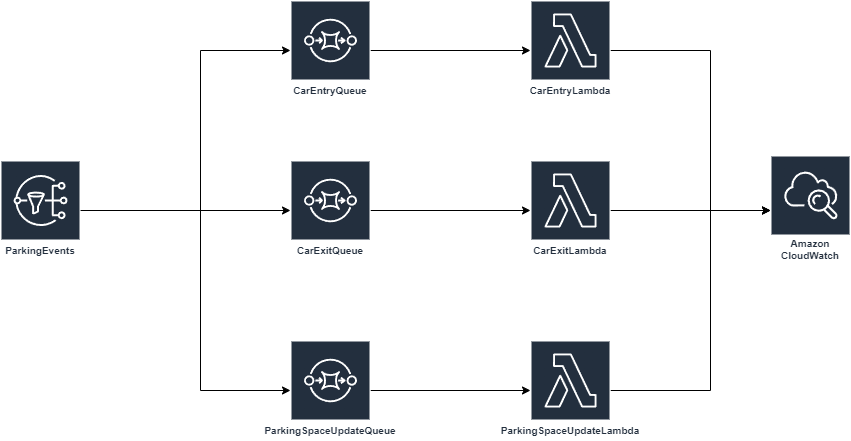

# Car Parking Management System - Step-by-Step Guide

## Introduction

This guide will walk you through setting up a Car Parking Management System using AWS services. The system leverages Amazon SNS (Simple Notification Service), Amazon SQS (Simple Queue Service), and AWS Lambda to manage and process parking events, such as car entries, exits, and parking space updates. The guide will also cover testing the setup, monitoring logs in CloudWatch, and cleaning up resources afterward.



## Use Case

### Scenario

Imagine a smart parking lot in a busy city. The parking lot is equipped with sensors and cameras to detect when cars enter or exit and to update the status of parking spaces. These events need to be processed in real-time to update parking availability, calculate parking fees, and notify parking lot managers.

### Workflow

1. **Car Entry**: When a car enters the parking lot, the system logs the car number and entry time.
2. **Car Exit**: When a car exits, the system logs the car number and exit time, calculates the parking fee, and updates the parking space status.
3. **Parking Space Update**: As soon as a car enters a parking space, the system updates the status of the space (e.g., occupied, under maintenance, reserved, or free) based on the car number and parking space ID.

## Prerequisites

Before you begin, make sure you have the following:
- An AWS account with necessary permissions to create and manage SNS, SQS, Lambda, and CloudWatch.
- Basic knowledge of AWS services, IAM roles, and Lambda functions.

## Step 1: Create an SNS Topic

1. Navigate to the **Amazon SNS Console**.
2. Click on **Create topic**.
3. Select **Standard** as the topic type.
4. Enter a **Topic name** (e.g., `ParkingEvents`).
5. Click **Create topic**.

## Step 2: Create SQS Queues

### 2.1 Car Entry Queue
1. Navigate to the **Amazon SQS Console**.
2. Click on **Create Queue**.
3. Choose **Standard Queue**.
4. Enter a **Queue Name** (e.g., `CarEntryQueue`).
5. Configure other settings as needed and click **Create Queue**.

### 2.2 Car Exit Queue
1. Repeat the steps to create another queue, but name it `CarExitQueue`.

### 2.3 Parking Space Update Queue
1. Repeat the steps to create another queue, but name it `ParkingSpaceUpdateQueue`.

## Step 3: Subscribe SQS Queues to the SNS Topic

1. Go back to the **Amazon SNS Console**.
2. Under the **Subscriptions** tab, click **Create subscription**.
3. For **Topic ARN**, choose **`ParkingEvent`**.
4. For **Protocol**, choose **SQS**.
5. For **Endpoint**, select the ARN of `CarEntryQueue`.
6. In the **Subscription filter policy** section, add the following JSON to filter messages based on the `EventType`:

   ```json
   {
     "EventType": ["CarEntry"]
   }
   ```
7. Click Create subscription to complete the setup.
8. Repeat these steps to create a subscription for ParkingSpaceUpdateQueue, with the following filter policy:
   ```json
   {
     "EventType": ["ParkingSpaceUpdate"]
   }
   ```
9. Repeat these steps to create a subscription for CarExitQueue, with the following filter policy:
   ```json
   {
     "EventType": ["CarExit"]
   }
   ```

## Step 4: Create IAM Role for Lambda Functions

1. Navigate to the **IAM Console**.
2. Click on **Roles** and then **Create role**.
3. Select **Trusted entity type** as **AWS Service** and **Use case** as **Lambda**.
4. Attach the following policies:
   - **AmazonSQSFullAccess**
   - **AWSLambdaBasicExecutionRole**
   - **AmazonSNSFullAccess**
5. Name the role `CarParkingLambdaRole` and click **Create role**.

## Step 5: Create Lambda Functions

### 5.1 Car Entry Lambda Function

1. Navigate to the **AWS Lambda Console**.
2. Click on **Create function**.
3. Choose **Author from scratch**.
4. Enter a **Function name** (e.g., `CarEntryLambda`).
5. Select **.NET Core 8** as the runtime.
6. Under **Permissions**, choose the IAM role created earlier (`CarParkingLambdaRole`).
7. Click **Create function**.

### 5.2 Car Exit Lambda Function
1. Repeat the steps to create another function, but name it `CarExitLambda`.

### 5.3 Parking Space Update Lambda Function
1. Repeat the steps to create another function, but name it `ParkingSpaceUpdateLambda`.

### 5.4 Write the Lambda Function Code
Refer src folder

### 5.5 Create a ZIP File for the Lambda Deployment

1. Install Amazon.Lambda.Tools Global Tools if not already installed.
```
    dotnet tool install -g Amazon.Lambda.Tools
```

If already installed check if new version is available.
```
    dotnet tool update -g Amazon.Lambda.Tools
```

2. Run following command where your csproj file is stored in command prompt
   
```
dotnet lambda package *.csproj -o bin/package.zip
```

### 5.6 Upload the ZIP File to Lambda

1. Go back to the **Lambda Console**.
2. In the **Code** tab, click on **Upload from** and select **.zip file**.
3. Choose the ZIP file you created.
4. Click **Save** to deploy the function.

#### Edit Runtime Settings

5. After the upload, navigate to the **Runtime settings** section under the **Code** tab.
6. **Set the Handler**:
   - Enter the handler as `"ParkingEventProcessorLambda::ParkingEventProcessorLambda.Function::FunctionHandler"`.
7. **Save Changes**:
   - Click **Save** to apply the new handler settings.

## Step 6: Configure Triggers for Lambda Functions

### 6.1 Car Entry Queue Trigger

1. In the **CarEntryLambda** Lambda function, go to the **Configuration** tab.
2. Click on **Add Trigger**.
3. Select **SQS** and choose the `CarEntryQueue`.
4. Click **Add**.

### 6.2 Car Exit Queue Trigger
1. Repeat the steps to add a trigger to the `CarExitLambda` for the `CarExitQueue`.

### 6.3 Parking Space Update Queue Trigger
1. Repeat the steps to add a trigger to the `ParkingSpaceUpdateLambda` for the `ParkingSpaceUpdateQueue`.

## Step 7: Test the Setup

1. Publish a test message to the `ParkingEvents` SNS topic with the `EventType` attribute set to `"CarEntry"`, `"CarExit"`, or `"ParkingSpaceUpdate"`.
2. Ensure the message is routed to the correct SQS queue and processed by the corresponding Lambda function.
3. Check **CloudWatch Logs** for each Lambda function to verify the event payload and processing results.

## Step 8: Monitor CloudWatch Logs

1. Navigate to **CloudWatch** in the AWS Console.
2. Go to **Logs** and select the log group for your Lambda function (e.g., `/aws/lambda/CarEntryLambda`).
3. Review the logs to verify that events are processed correctly and that no errors occurred.

## Step 9: Clean Up Resources

After testing, clean up the resources to avoid unnecessary charges:

1. **Delete the Lambda Functions**: Go to the **Lambda Console** and delete `CarEntryLambda`, `CarExitLambda`, and `ParkingSpaceUpdateLambda`.
2. **Delete the SQS Queues**: Go to the **SQS Console** and delete `CarEntryQueue`, `CarExitQueue`, and `ParkingSpaceUpdateQueue`.
3. **Delete the SNS Topic**: Go to the **SNS Console** and delete the `ParkingEvents` topic.
4. **Delete the IAM Role**: Go to the **IAM Console** and delete the `CarParkingLambdaRole` role.
5. **Delete CloudWatch Log Groups**: Go to **CloudWatch Logs** and delete the log groups associated with your Lambda functions.

## Example JSON Payloads

### 1. Car Entry Event (`CarEntry`)

```json
{
  "EventType": "CarEntry",
  "CarId": "ABC1234",
  "EntryTime": "2024-08-11T08:30:00Z"
}
```

### 2. Car Entry Event (`CarEntry`)
```json
{
  "EventType": "CarExit",
  "CarId": "ABC1234",
  "ExitTime": "2024-08-11T10:45:00Z"
}
```
### 3. Parking Space Update Event (ParkingSpaceUpdate)

```json
{
  "EventType": "ParkingSpaceUpdate",
  "CarId": "ABC1234",
  "ParkingSpaceId": "PS45",
  "Status": "Occupied",
  "UpdateTime": "2024-08-11T08:30:00Z"
}
```
